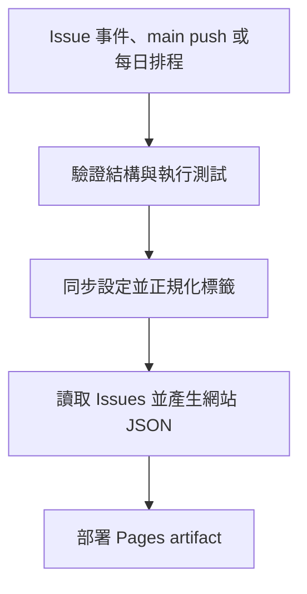

# 專案架構

## 設計原則

1. GitHub Issues 與 Labels 是案件資料的唯一來源。
2. `config/taxonomy.json` 是縣市、問題類型與狀態的唯一分類來源。
3. 網站 JSON 是建置產物，不進入 Git 歷史。
4. Issue 正規化、資料轉換與統計必須能在本機測試。
5. 沒有精確座標時，只呈現縣市彙總位置。

## 資料流程



`publish.yml` 在同一個 workflow run 內完成標籤正規化後再重新讀取 Issues，因此不依賴由 `GITHUB_TOKEN` 產生的第二個事件。排程執行時只重建資料與部署，不修改 Git 歷史。

## 分類資料

`config/taxonomy.json` 包含：

- 縣市名稱與縣市中心座標
- Issue Form 選項與網站顯示類型的對應
- 狀態標籤、顏色及 CSS class
- 受管理標籤的前綴

Issue Form 仍由 GitHub YAML 定義，`npm run validate` 會確認其中的縣市與類型沒有遺漏。

## 網站資料格式

網站資料包含 `schemaVersion`、`generatedAt`、統計資料及案件陣列。每筆案件會標示：

- `positionPrecision: exact`：由地圖分享連結解析出座標
- `positionPrecision: city`：只有縣市資訊
- `positionPrecision: unknown`：沒有可呈現的位置資訊

前端不會替 `city` 或 `unknown` 案件產生隨機座標。

## 本機測試

```bash
npm run prepare:local
npm run check
```

`prepare:local` 只會在被 Git 忽略的 `website/data/` 產生示範資料。
